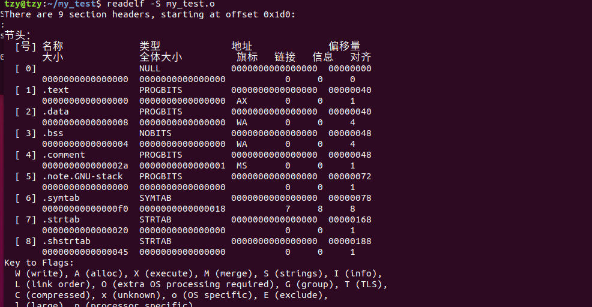

# ELF 文件格式 ------- 节头部表

## 1. 背景

​	由于一直对 elf 文件充满好奇心，链接器如何将 elf 文件链接成可执行文件的？可执行文件为什么可执行？操作系统到底是怎么将该文件加载并让 CPU 去执行的？这些真要弄明白，其实并不容易，因此，首先就从 elf 文件的格式开始探索吧！！

## 2. 什么是 ELF

​	ELF（Executable and Linking Format）是一种文件格式，该格式的文件可执行，可链接。可执行是站在操作系统的角度的，可链接是站在链接器（Linker）的角度。可执行指的是操作系统能够加载该文件到内存中，并让 CPU 去执行该文件中的指令。可链接指的是链接器能够将分离的这种格式的文件链接（拼图）成为一个可以让操作系统加载的文件。

​	实际上，让 cpu 执行与 链接器链接 这两个动作是非常复杂的，而 elf 格式的目的就是辅助操作系统或者链接器去完成这些动作，不然随意整一格式的文件，操作系统与链接器肯定是不认识的（除非自己写操作系统，自己写编译器、链接器，然后自己定出自己的格式）。

​	经常使用的 ELF 文件类型

* 可执行文件（.out）: 该文件上述说过了，可被操作系统加载
* 可重定位文件（.o）: 上述可链接文件
* 共享库文件（.so）: 动态库文件
* 内核转储文件（coredump）: 当用户态程序发生段错误时，操作系统将该进程发生错误时刻的上下文保存到该文件中（pid、ppid、信号、寄存器等等信息）

## 3. 实验环境

1. 操作系统使用的是 ubuntu 18.04，其他 linux 发行版皆可

2. 编译工具链：gcc

3. 实验源码，只编译不链接，本文章探究可重定位文件（可执行文件与之类似）。

   ```c
   gcc -c my_test.c
   
   unsigned int data_0 = 0xffff0000;
   unsigned int data_1 = 0xffff1111;
   
   static int data_bss;
   
   int func_0(void);
   int func_1(void);
   ```

4. 可执行文件是将可重定位文件中相同类型的的 section 聚合到一起形成 Segment，这样有利于操作系统的加载。

## 4. ELF 文件布局


从上到下，包含了 elf 头、程序头表、各种类型的 section、节头表，从箭头可以看出，头表中指向了中间的各个节

> section 本文叫做 节

## 5. ELF header

​	头的作用就是为了表明，我是 elf 格式的文件，是一种身份的表示，使用 hexdump 工具将文件中的数据按照 16 进制的方式显示出来，如下

```
hexdump -n 512 -C my_test.o //打印前 512 字节，并显示出对应 ascii 码，高字节在后，如下

00000000  7f 45 4c 46 02 01 01 00  00 00 00 00 00 00 00 00  |.ELF............|
00000010  01 00 3e 00 01 00 00 00  00 00 00 00 00 00 00 00  |..>.............|
00000020  00 00 00 00 00 00 00 00  d0 01 00 00 00 00 00 00  |................|
00000030  00 00 00 00 40 00 00 00  00 00 40 00 09 00 08 00  |....@.....@.....|
00000040  00 00 ff ff 11 11 ff ff  00 47 43 43 3a 20 28 55  |.........GCC: (U|
00000050  62 75 6e 74 75 20 37 2e  35 2e 30 2d 33 75 62 75  |buntu 7.5.0-3ubu|
00000060  6e 74 75 31 7e 31 38 2e  30 34 29 20 37 2e 35 2e  |ntu1~18.04) 7.5.|
00000070  30 00 00 00 00 00 00 00  00 00 00 00 00 00 00 00  |0...............|
00000080  00 00 00 00 00 00 00 00  00 00 00 00 00 00 00 00  |................|
00000090  01 00 00 00 04 00 f1 ff  00 00 00 00 00 00 00 00  |................|
000000a0  00 00 00 00 00 00 00 00  00 00 00 00 03 00 01 00  |................|
000000b0  00 00 00 00 00 00 00 00  00 00 00 00 00 00 00 00  |................|
000000c0  00 00 00 00 03 00 02 00  00 00 00 00 00 00 00 00  |................|
000000d0  00 00 00 00 00 00 00 00  00 00 00 00 03 00 03 00  |................|
000000e0  00 00 00 00 00 00 00 00  00 00 00 00 00 00 00 00  |................|
000000f0  09 00 00 00 01 00 03 00  00 00 00 00 00 00 00 00  |................|
00000100  04 00 00 00 00 00 00 00  00 00 00 00 03 00 05 00  |................|
00000110  00 00 00 00 00 00 00 00  00 00 00 00 00 00 00 00  |................|
00000120  00 00 00 00 03 00 04 00  00 00 00 00 00 00 00 00  |................|
00000130  00 00 00 00 00 00 00 00  12 00 00 00 11 00 02 00  |................|
00000140  00 00 00 00 00 00 00 00  04 00 00 00 00 00 00 00  |................|
00000150  19 00 00 00 11 00 02 00  04 00 00 00 00 00 00 00  |................|
00000160  04 00 00 00 00 00 00 00  00 68 65 6c 6c 6f 2e 63  |.........hello.c|
00000170  00 64 61 74 61 5f 62 73  73 00 64 61 74 61 5f 30  |.data_bss.data_0|
00000180  00 64 61 74 61 5f 31 00  00 2e 73 79 6d 74 61 62  |.data_1...symtab|
00000190  00 2e 73 74 72 74 61 62  00 2e 73 68 73 74 72 74  |..strtab..shstrt|
000001a0  61 62 00 2e 74 65 78 74  00 2e 64 61 74 61 00 2e  |ab..text..data..|
000001b0  62 73 73 00 2e 63 6f 6d  6d 65 6e 74 00 2e 6e 6f  |bss..comment..no|
000001c0  74 65 2e 47 4e 55 2d 73  74 61 63 6b 00 00 00 00  |te.GNU-stack....|
000001d0  00 00 00 00 00 00 00 00  00 00 00 00 00 00 00 00  |................|
*
00000200
```

​	这就是 elf 文件中前 512 字节的内容，文件头数据结构定义如下

```c
/* linux 内核 elf.h  中定义 */

typedef __u64	Elf64_Addr;
typedef __u16	Elf64_Half;
typedef __s16	Elf64_SHalf;
typedef __u64	Elf64_Off;
typedef __s32	Elf64_Sword;
typedef __u32	Elf64_Word;
typedef __u64	Elf64_Xword;
typedef __s64	Elf64_Sxword;

#define EI_NIDENT 16

typedef struct elf64_hdr {
  unsigned char	e_ident[EI_NIDENT];// 7f 45 4c 46 02 01 01 00  00 00 00 00 00 00 00 00
  Elf64_Half e_type;// 01 00 ，elf 文件类型 1 为重定位文件
  Elf64_Half e_machine; // 3e 00
  Elf64_Word e_version; // 01 00 00 00 
  Elf64_Addr e_entry; // 00 00 00 00 00 00 00 00 程序入口地址，可重定位文件不可执行，此时还没有入口地址
  Elf64_Off e_phoff;// 00 00 00 00 00 00 00 00 由于是可重定位文件，暂时不存在程序头表，因此为 0
  Elf64_Off e_shoff;// d0 01 00 00 00 00 00 00 节头表在该文件中的偏移 0x1d0
  Elf64_Word e_flags; // 00 00 00 00
  Elf64_Half e_ehsize; // 40 00 elf header 大小，也就是在该文件中的占用也就是该结构的占用 sizeof(elf64_hdr)
  Elf64_Half e_phentsize; // 00 00 程序头表大小，可重定位文件中没有，因此为 0
  Elf64_Half e_phnum; // 00 00 程序头表个数，可重定位文件中没有，因此为 0
  Elf64_Half e_shentsize; //40 00 节头表大小，0x40 字节
  Elf64_Half e_shnum; // 09 00 节头表个数
  Elf64_Half e_shstrndx; // 08 00 节字符串表在 节头表中的下标
} Elf64_Ehdr;
```

据上述分析，ELF 文件头中的内容已经按照数据结构的定义一一对照起来了，可以使用 readelf -h my_test.o 进一步查看，如下

```
ELF 头：
  Magic：   7f 45 4c 46 02 01 01 00 00 00 00 00 00 00 00 00  // e_ident 16字节
  类别:                              ELF64 //  e_ident[4] == 02
  数据:                              2 补码，小端序 (little endian) // e_ident[5] == 01
  版本:                              1 (current) // e_ident[6] == 01
  OS/ABI:                            UNIX - System V // e_machine
  ABI 版本:                          0
  类型:                              REL (可重定位文件) // e_type
  系统架构:                          Advanced Micro Devices X86-64 // e_machine
  版本:                              0x1 // e_version
  入口点地址：               0x0 // e_entry
  程序头起点：          0 (bytes into file) // e_entry
  Start of section headers:          464 (bytes into file) // e_shoff 0x1d0
  标志：             0x0
  本头的大小：       64 (字节) // e_ehsize 0x40
  程序头大小：       0 (字节) // e_phentsize 0x00
  Number of program headers:         0 // e_phnum 0x00
  节头大小：         64 (字节) // e_shentsize 0x40
  节头数量：         9 // e_shnum 0x9
  字符串表索引节头： 8 // 0x8
```

​	有了 elf head ，可以知道节头部表偏移，得到了 节头部表的位置，解析节头部表就能够找到 节，我们的代码中的 代码与数据就放在这些节中，比如代码放在 .text 节、可读写变量放在 .data 节、初始化为0或者未初始化的全局或静态变量放在 .bss 节、变量名称放在 .strtab 节、节名称放在 .shstrtab 节等等。

## 6. ELF section head table

​	根据分析 elf 头我们知道 section head table 的位置 0x1d0，我们找到 0x1d0 的位置，将该文件用 hexdump -C my_test.o 全部打印出来，如下（hexdump 自动省略了一部分为0数据，用 *代替）

```
00000000  7f 45 4c 46 02 01 01 00  00 00 00 00 00 00 00 00  |.ELF............|
00000010  01 00 3e 00 01 00 00 00  00 00 00 00 00 00 00 00  |..>.............|
00000020  00 00 00 00 00 00 00 00  d0 01 00 00 00 00 00 00  |................|
00000030  00 00 00 00 40 00 00 00  00 00 40 00 09 00 08 00  |....@.....@.....|
00000040  00 00 ff ff 11 11 ff ff  00 47 43 43 3a 20 28 55  |.........GCC: (U|
00000050  62 75 6e 74 75 20 37 2e  35 2e 30 2d 33 75 62 75  |buntu 7.5.0-3ubu|
00000060  6e 74 75 31 7e 31 38 2e  30 34 29 20 37 2e 35 2e  |ntu1~18.04) 7.5.|
00000070  30 00 00 00 00 00 00 00  00 00 00 00 00 00 00 00  |0...............|
00000080  00 00 00 00 00 00 00 00  00 00 00 00 00 00 00 00  |................|
00000090  01 00 00 00 04 00 f1 ff  00 00 00 00 00 00 00 00  |................|
000000a0  00 00 00 00 00 00 00 00  00 00 00 00 03 00 01 00  |................|
000000b0  00 00 00 00 00 00 00 00  00 00 00 00 00 00 00 00  |................|
000000c0  00 00 00 00 03 00 02 00  00 00 00 00 00 00 00 00  |................|
000000d0  00 00 00 00 00 00 00 00  00 00 00 00 03 00 03 00  |................|
000000e0  00 00 00 00 00 00 00 00  00 00 00 00 00 00 00 00  |................|
000000f0  09 00 00 00 01 00 03 00  00 00 00 00 00 00 00 00  |................|
00000100  04 00 00 00 00 00 00 00  00 00 00 00 03 00 05 00  |................|
00000110  00 00 00 00 00 00 00 00  00 00 00 00 00 00 00 00  |................|
00000120  00 00 00 00 03 00 04 00  00 00 00 00 00 00 00 00  |................|
00000130  00 00 00 00 00 00 00 00  12 00 00 00 11 00 02 00  |................|
00000140  00 00 00 00 00 00 00 00  04 00 00 00 00 00 00 00  |................|
00000150  19 00 00 00 11 00 02 00  04 00 00 00 00 00 00 00  |................|
00000160  04 00 00 00 00 00 00 00  00 68 65 6c 6c 6f 2e 63  |.........hello.c|
00000170  00 64 61 74 61 5f 62 73  73 00 64 61 74 61 5f 30  |.data_bss.data_0|
00000180  00 64 61 74 61 5f 31 00  00 2e 73 79 6d 74 61 62  |.data_1...symtab|
00000190  00 2e 73 74 72 74 61 62  00 2e 73 68 73 74 72 74  |..strtab..shstrt|
000001a0  61 62 00 2e 74 65 78 74  00 2e 64 61 74 61 00 2e  |ab..text..data..|
000001b0  62 73 73 00 2e 63 6f 6d  6d 65 6e 74 00 2e 6e 6f  |bss..comment..no|
000001c0  74 65 2e 47 4e 55 2d 73  74 61 63 6b 00 00 00 00  |te.GNU-stack....|
000001d0  00 00 00 00 00 00 00 00  00 00 00 00 00 00 00 00  |................| // section head table
*
00000210  1b 00 00 00 01 00 00 00  06 00 00 00 00 00 00 00  |................|
00000220  00 00 00 00 00 00 00 00  40 00 00 00 00 00 00 00  |........@.......|
00000230  00 00 00 00 00 00 00 00  00 00 00 00 00 00 00 00  |................|
00000240  01 00 00 00 00 00 00 00  00 00 00 00 00 00 00 00  |................|
00000250  21 00 00 00 01 00 00 00  03 00 00 00 00 00 00 00  |!...............|
00000260  00 00 00 00 00 00 00 00  40 00 00 00 00 00 00 00  |........@.......|
00000270  08 00 00 00 00 00 00 00  00 00 00 00 00 00 00 00  |................|
00000280  04 00 00 00 00 00 00 00  00 00 00 00 00 00 00 00  |................|
00000290  27 00 00 00 08 00 00 00  03 00 00 00 00 00 00 00  |'...............|
000002a0  00 00 00 00 00 00 00 00  48 00 00 00 00 00 00 00  |........H.......|
000002b0  04 00 00 00 00 00 00 00  00 00 00 00 00 00 00 00  |................|
*
000002d0  2c 00 00 00 01 00 00 00  30 00 00 00 00 00 00 00  |,.......0.......|
000002e0  00 00 00 00 00 00 00 00  48 00 00 00 00 00 00 00  |........H.......|
000002f0  2a 00 00 00 00 00 00 00  00 00 00 00 00 00 00 00  |*...............|
00000300  01 00 00 00 00 00 00 00  01 00 00 00 00 00 00 00  |................|
00000310  35 00 00 00 01 00 00 00  00 00 00 00 00 00 00 00  |5...............|
00000320  00 00 00 00 00 00 00 00  72 00 00 00 00 00 00 00  |........r.......|
00000330  00 00 00 00 00 00 00 00  00 00 00 00 00 00 00 00  |................|
00000340  01 00 00 00 00 00 00 00  00 00 00 00 00 00 00 00  |................|
00000350  01 00 00 00 02 00 00 00  00 00 00 00 00 00 00 00  |................|
00000360  00 00 00 00 00 00 00 00  78 00 00 00 00 00 00 00  |........x.......|
00000370  f0 00 00 00 00 00 00 00  07 00 00 00 08 00 00 00  |................|
00000380  08 00 00 00 00 00 00 00  18 00 00 00 00 00 00 00  |................|
00000390  09 00 00 00 03 00 00 00  00 00 00 00 00 00 00 00  |................|
000003a0  00 00 00 00 00 00 00 00  68 01 00 00 00 00 00 00  |........h.......|
000003b0  20 00 00 00 00 00 00 00  00 00 00 00 00 00 00 00  | ...............|
000003c0  01 00 00 00 00 00 00 00  00 00 00 00 00 00 00 00  |................|
000003d0  11 00 00 00 03 00 00 00  00 00 00 00 00 00 00 00  |................|
000003e0  00 00 00 00 00 00 00 00  88 01 00 00 00 00 00 00  |................|
000003f0  45 00 00 00 00 00 00 00  00 00 00 00 00 00 00 00  |E...............|
00000400  01 00 00 00 00 00 00 00  00 00 00 00 00 00 00 00  |................|
00000410
```

从 elf 头中可以知道每一个 section head table 的大小为 0x40 个字节，也就是从 0x1d0 开始，每 4 行数据代表一个 table，section head table 结构如下

```c
typedef struct elf64_shdr {
  Elf64_Word sh_name;		/* 节名称在 节字符串表中的索引 */
  Elf64_Word sh_type;		/* 节类型 */
  Elf64_Xword sh_flags;		/* 标识该节的是否可修改可执行等内容 */
  Elf64_Addr sh_addr;		/* 该节在内存中的虚拟地址 */
  Elf64_Off sh_offset;		/* 节在该文件中的偏移 */
  Elf64_Xword sh_size;		/* 该节的大小 */
  Elf64_Word sh_link;		/* Index of another section */
  Elf64_Word sh_info;		/* Additional section information */
  Elf64_Xword sh_addralign;	/* Section alignment */
  Elf64_Xword sh_entsize;	/* 如果该节是一个表项，该值为每个表项的大小，如符号表 */
} Elf64_Shdr;
```

通过 struct elf64_shdr 这个结构，配合 hexdump 出来的数据，可以分析出各 section 的基本信息以及在该文件中的偏移，通过 readelf -h my_test.o 可以查看该 elf 文件中各个 section 的信息

可以发现，.text 节位于 section head table 的 1 号位置，而每个表项占用 sizeof(struct elf64_shdr) = 64 字节，因此 .text 节头部表在该文件的起始节头部表 + 64 字节 = 0x1d0 + 0x40 = 0x210 处，如下

```
00000000  7f 45 4c 46 02 01 01 00  00 00 00 00 00 00 00 00  |.ELF............|
00000010  01 00 3e 00 01 00 00 00  00 00 00 00 00 00 00 00  |..>.............|
00000020  00 00 00 00 00 00 00 00  d0 01 00 00 00 00 00 00  |................|
00000030  00 00 00 00 40 00 00 00  00 00 40 00 09 00 08 00  |....@.....@.....|
00000040  00 00 ff ff 11 11 ff ff  00 47 43 43 3a 20 28 55  |.........GCC: (U|
00000050  62 75 6e 74 75 20 37 2e  35 2e 30 2d 33 75 62 75  |buntu 7.5.0-3ubu|
00000060  6e 74 75 31 7e 31 38 2e  30 34 29 20 37 2e 35 2e  |ntu1~18.04) 7.5.|
00000070  30 00 00 00 00 00 00 00  00 00 00 00 00 00 00 00  |0...............|
00000080  00 00 00 00 00 00 00 00  00 00 00 00 00 00 00 00  |................|
00000090  01 00 00 00 04 00 f1 ff  00 00 00 00 00 00 00 00  |................|
000000a0  00 00 00 00 00 00 00 00  00 00 00 00 03 00 01 00  |................|
000000b0  00 00 00 00 00 00 00 00  00 00 00 00 00 00 00 00  |................|
000000c0  00 00 00 00 03 00 02 00  00 00 00 00 00 00 00 00  |................|
000000d0  00 00 00 00 00 00 00 00  00 00 00 00 03 00 03 00  |................|
000000e0  00 00 00 00 00 00 00 00  00 00 00 00 00 00 00 00  |................|
000000f0  09 00 00 00 01 00 03 00  00 00 00 00 00 00 00 00  |................|
00000100  04 00 00 00 00 00 00 00  00 00 00 00 03 00 05 00  |................|
00000110  00 00 00 00 00 00 00 00  00 00 00 00 00 00 00 00  |................|
00000120  00 00 00 00 03 00 04 00  00 00 00 00 00 00 00 00  |................|
00000130  00 00 00 00 00 00 00 00  12 00 00 00 11 00 02 00  |................|
00000140  00 00 00 00 00 00 00 00  04 00 00 00 00 00 00 00  |................|
00000150  19 00 00 00 11 00 02 00  04 00 00 00 00 00 00 00  |................|
00000160  04 00 00 00 00 00 00 00  00 68 65 6c 6c 6f 2e 63  |.........hello.c|
00000170  00 64 61 74 61 5f 62 73  73 00 64 61 74 61 5f 30  |.data_bss.data_0|
00000180  00 64 61 74 61 5f 31 00  00 2e 73 79 6d 74 61 62  |.data_1...symtab|
00000190  00 2e 73 74 72 74 61 62  00 2e 73 68 73 74 72 74  |..strtab..shstrt|
000001a0  61 62 00 2e 74 65 78 74  00 2e 64 61 74 61 00 2e  |ab..text..data..| // .text: 2e 74 65 78 74
000001b0  62 73 73 00 2e 63 6f 6d  6d 65 6e 74 00 2e 6e 6f  |bss..comment..no| // .data: 2e 64 61 74 61
000001c0  74 65 2e 47 4e 55 2d 73  74 61 63 6b 00 00 00 00  |te.GNU-stack....|
000001d0  00 00 00 00 00 00 00 00  00 00 00 00 00 00 00 00  |................| // 0 号无名节的信息
*
00000210  1b 00 00 00 01 00 00 00  06 00 00 00 00 00 00 00  |................| // .text 节的信息
00000220  00 00 00 00 00 00 00 00  40 00 00 00 00 00 00 00  |........@.......|
00000230  00 00 00 00 00 00 00 00  00 00 00 00 00 00 00 00  |................|
00000240  01 00 00 00 00 00 00 00  00 00 00 00 00 00 00 00  |................|
00000250  21 00 00 00 01 00 00 00  03 00 00 00 00 00 00 00  |!...............|// .data 节的信息
00000260  00 00 00 00 00 00 00 00  40 00 00 00 00 00 00 00  |........@.......|
00000270  08 00 00 00 00 00 00 00  00 00 00 00 00 00 00 00  |................|
00000280  04 00 00 00 00 00 00 00  00 00 00 00 00 00 00 00  |................|
00000290  27 00 00 00 08 00 00 00  03 00 00 00 00 00 00 00  |'...............|// .bss 节的信息
000002a0  00 00 00 00 00 00 00 00  48 00 00 00 00 00 00 00  |........H.......|
000002b0  04 00 00 00 00 00 00 00  00 00 00 00 00 00 00 00  |................|
*
000002d0  2c 00 00 00 01 00 00 00  30 00 00 00 00 00 00 00  |,.......0.......|// .comment 节信息
000002e0  00 00 00 00 00 00 00 00  48 00 00 00 00 00 00 00  |........H.......|
000002f0  2a 00 00 00 00 00 00 00  00 00 00 00 00 00 00 00  |*...............|
00000300  01 00 00 00 00 00 00 00  01 00 00 00 00 00 00 00  |................|
00000310  35 00 00 00 01 00 00 00  00 00 00 00 00 00 00 00  |5...............|// .note.GNU-stack 节信息
00000320  00 00 00 00 00 00 00 00  72 00 00 00 00 00 00 00  |........r.......|
00000330  00 00 00 00 00 00 00 00  00 00 00 00 00 00 00 00  |................|
00000340  01 00 00 00 00 00 00 00  00 00 00 00 00 00 00 00  |................|
00000350  01 00 00 00 02 00 00 00  00 00 00 00 00 00 00 00  |................|// .symtab 节信息
00000360  00 00 00 00 00 00 00 00  78 00 00 00 00 00 00 00  |........x.......|
00000370  f0 00 00 00 00 00 00 00  07 00 00 00 08 00 00 00  |................|
00000380  08 00 00 00 00 00 00 00  18 00 00 00 00 00 00 00  |................|
00000390  09 00 00 00 03 00 00 00  00 00 00 00 00 00 00 00  |................|// .strtab 节信息
000003a0  00 00 00 00 00 00 00 00  68 01 00 00 00 00 00 00  |........h.......|
000003b0  20 00 00 00 00 00 00 00  00 00 00 00 00 00 00 00  | ...............|
000003c0  01 00 00 00 00 00 00 00  00 00 00 00 00 00 00 00  |................|
000003d0  11 00 00 00 03 00 00 00  00 00 00 00 00 00 00 00  |................|// .shstrtab 节信息
000003e0  00 00 00 00 00 00 00 00  88 01 00 00 00 00 00 00  |................|
000003f0  45 00 00 00 00 00 00 00  00 00 00 00 00 00 00 00  |E...............|
00000400  01 00 00 00 00 00 00 00  00 00 00 00 00 00 00 00  |................|
00000410
```

​	分析 .text 节，该节的名称在 节字符串表中的偏移为 0x1b，而节字符串表在整个文件中的偏移为 0x188 处，因此，.text 节的节名 “.text” 在该 elf 文件的 0x188 + 0x1b  = 0x1a3 处，以 \0 结尾，因此 0x1a3 处开始的 2e 74 65 78 74，这 5 个字节对应的 ascii 字符就是 .text，其余节同理，如 .data 节的名字在节字符串表中的偏移是 0x21，因此 0x21 + 0x188 = 0x1A9，对应的 ascii 码为 2e 64 61 74 61。

​	sh_entsize 这个成员很有意思，对于普通的节，该成员的值为 0，但有些节这个成员不为 0，表明这个节中的内容同样是表组成的，该表项的大小为 sh_entsize。

​	.symtab 节中 sh_entsize 为 18 00 00 00 00 00 00 00 也就是 0x18 字节，也就是 24 字节，表明该节中的内容同样是个表，类似于正在分析的 section head table (节头部表)，为什么偏偏是 24 字节？通过符号表的结构来分析，如下，首先猜测，sizeof(struct elf64_sym) = 24 字节

```c
typedef struct elf64_sym {
  Elf64_Word st_name;		/* 该符号的名字在字符串表中的起始下标 */
  unsigned char	st_info;	/* Type and binding attributes */
  unsigned char	st_other;	/* No defined meaning, 0 */
  Elf64_Half st_shndx;		/* Associated section index */
  Elf64_Addr st_value;		/* Value of the symbol */
  Elf64_Xword st_size;		/* Associated symbol size */
} Elf64_Sym;
```

​	对于符号表的分析，另起一篇文章，符号表还是蛮重要的。

## Symbal table

```c
typedef struct elf64_sym {
  Elf64_Word st_name;		/* 该符号的名字在字符串表中的起始下标 */
  unsigned char	st_info;	/* 该符号的类型以及作用域信息 */
  unsigned char	st_other;	/* 暂未使用 */
  Elf64_Half st_shndx;		/* 该符号所在的 section 的下标，如 .data 节为 2 */
  Elf64_Addr st_value;		/* 该符号的值在该 section 中的偏移 */
  Elf64_Xword st_size;		/* 该符号的大小 */
} Elf64_Sym;
```

* 上述结构描述了一个符号在可重定位文件中的所有信息

* st_name 表示该符号的名字在相对于字符串表的起始地址的偏移，通过该信息，能够找到该符号的名字

* st_info 这个成员极为重要，是个位图，前 4 bit 与 后 4 bit 分别表示该符号的类型与 bind（作用域）

  * type

    | value | info                             |      |
    | ----- | -------------------------------- | ---- |
    | 0     | 该符号没类型                     |      |
    | 1     | 该符号是个对象类型，如数组、变量 |      |
    | 2     | 该符号是个函数                   |      |
    | 3     | 该符号与某个节区相关             |      |
    | 4     | 这种类型的符号属于 ABS 节区      |      |

  * bind

    | value | info                                       |      |
    | ----- | ------------------------------------------ | ---- |
    | 0     | 局部符号，static 声明的符号                |      |
    | 1     | 全局符号，不被 static 声明的变量函数等     |      |
    | 2     | 弱符号，与全局符号类型，他们的优先级比较低 |      |

* st_shndx 表示该符属于那个节
* st_value 表示该符号的值在对应的节起始地址的偏移
* st_size 表示该符号占用的大小，单位 byte

## 意义

​	汇编器为每个符号生成符号表的意义在于：由于对于一个 C 项目来说，是分模块的，每个模块对应一个或者多个源文件，并不是所有的功能都集中到一个文件中去，因此，多文件之间定义的符号名字就可能会冲突，同时多模块之间的符号可以相互引用，为了实现这一机制，就需要提供一个数据结构描述一个符号，如该符号是否是全局的，是否能够被外部引用，是什么类型的符号等等。

​	链接器将所有的可重定位文件作为输入，如果幸运的话，会生成可执行文件。其中，就需要解决各个模块之间符号的关系，就需要使用到该符号的描述（struct elf64_sym），该过程叫做符号解析

* 符号解析无非完成以下几件事情

  * 对于定义在同一模块内的局部符号，有且仅有一份，两个同名局部符号，链接器立即报错
* 对于一个模块引用外部符号而言，就有些复杂了。由于多个目标文件可能会定义多个相同名字的全局符号。这种情况下链接器只能选择其中一个符号，要么直接报错
  
  * linux 系统采纳的方法设计编译器、汇编器、和链接器之间的协作
* 链接器解析符号引用的方法是将每个引用与它输入的可重定位目标文件的符号表中的一个确定的符号定义关联起来。
* 对全局符号的引用解析就棘手得多。当编译器遇到一个不是在当前模块中定义得的符号时，会假设该符号是在其他某个模块中定义的，生成一个链接器符号表条目，并把它交给链接器处理，如果链接器在它的任何输入模块中都找不到这个别引用符号的定义，就输出一条错误信息并终止。
* 在编译时，编译器向汇编器输出每个全局符号，或者是强或者是弱，而汇编器把这个信息隐含地编码在可重定位目标文件的符号表里。函数和已初始化地全局变量是强符号，未初始化的全局变量是弱符号。
* 根据强弱符号的定义，Linux 链接器使用下面的规则来处理多重定义的符号名：

  * 规则1：不允许有多个同名的强符号
  * 规则2：如果一个强符号和多个弱符号同名，那么选择强符号
  * 规则3：如果有多个弱符号同名，那么从这些弱符号中任意选择一个
* 重定位
  * 就是将目标文件中各个符号的地址重新设置为新的可执行目标文件中的地址（目标文件各符号地址是相对地址，相对于目标文件自己，也就是 0 地址）
  * 将所有同类型的 section 合并为一个 segment，并确定该 segment 中所有符号的地址
  * 重定位目标文件中引用的外部符号，汇编器会将引用外部符号的指令的操作数设置为 0，如 call  0x00000000，然后在 .rel.text section 中记录该可重定位条目。链接器遍历 .rel.text 和 .rel.data 节，将某条外部引用的指令修改为真正的符号的地址，如将 call  0x000000 这条机器码所在的地址处的操作码 0x000000 修改为 0x2343424，但也不一定是修改为真正的符号地址的，也可能修改为相对地址，这与  pc 指针的寻址方式有关，相对寻址时，该引用处的地址为一个数字 + 下一条指令的地址 = 引用符号的地址
* 经过符号解析与重定位之后，可执行文件就真的生成了，可执行文件的加载与运行地址被确定下来了，接下来操作系统将可执行文件加载到指定的位置中去，并将 cpu 使用权交给该程序
* 上述的链接是静态链接，生成的机器码是位置有关码，就是必须将该程序中的机器码加载到链接时指定的位置中去才能执行，随便放在一个地方是不能执行的
* 与位置相关码相反的是位置无关码，位置无关吗通常用在动态库上，位置无关码可能不需要操作系统来加载到内存中的某个位置中去，可能是引用该动态库的程序执行时，才去动态库中将该符号取出来，然后执行

