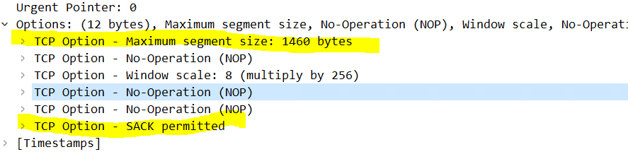

## TCP

## 1.TCP可靠传输 -  停止等待ARQ协议

* ARQ(Automatic Repeat-reQuest)，自动重传请求

* 第一种情况：无差错，A发送数据包给B，B确认收到（返回ack）,然后A继续发
* 第二种：A发送数据包途中丢了，B收不到，此时A收不到确认，超时重传
* 第三种：B返回的确认信息中途丢了，此时A认为B没收到，重传一次数据包，然后B收到了数据包，发现这包数据已经收到了，丢掉数据，返回确认信息，A收到确认信息继续发送下一包
* 第三种：A发送数据包，B收到了，但是确认信息由于某些原因（网络拥堵等等）没有及时送达，A认为超时了，重传，然后B收到数据包了，返回确认信息，此时A收到了确认信息，发送下一包数据，此时B收到的数据包，但是此时第一次的确认信息A又收到了，此时A发现这个确认信息已经收到了（超时重传时的返回），A就啥也不做。
* 弊端：效率很低，A必须等待B返回确认信息

## 2. TCP可靠传输 -  连续ARQ协议 + 滑动窗口协议

* 发送窗口中的分组连续发送，发送完后，停止等待确认

  

* 接收方连续收到4组数据后，只需要将最后一个数据的编号返回给发送方
* B这边传输层有个缓存，告诉A这个窗口有多大（拥塞控制的前奏？？）
* 有个重要的标志：序号（这一次传给对方的TCP数据部分的第一个字节的编号），根据返回的这个序号，发送端知道下次需要发送那个分组
* 如果滑动窗口中的分组丢了一组，接收方会返回丢的那一组分组的序号，此时，发送方就会重新发送丢这一组的数据，同时丢这一个分组的后续分组也重新发送，因此存在接收端接收数据被覆盖的情况，导致效率变低（理想情况下是，丢那一组，就重发这一组）

## 3. TCP可靠传输 -  SACK（选择确认）

* 

* 在TCP通信过程中，如果发送序列中间某个数据包丢失（比如 1  2 3 4 5 中的3丢失了）
* 按照之前的做法，TCP  会重传最后确认的分组的后续分组（最后确认的是2，会重传3 4 5），降低了TCP性能
* 为了改善上述情况，发展出了SACK（Selective Acknowledgment，选择性确认）技术，告诉送方哪些数据丢失，那些数据已经提前收到
* SACK 信息会放在TCP首部的选项部分
  * Kind：一个字节，类型，为5表示是SACK选项
  * Length：一个字节，表明SACK选项一共占用了多少字节
  * Left Edge：占4个字节，左边界
  * Right Edge：占4个字节，右边界
  * 
  * 有确认号是201，想让对方发201开始的数据，发过来之后，其中有些数据丢了，此时根据左右边界告诉对方，收到了那些数据，此时，对方知道了我那些数据没收到，选择性的将没收到的数据再次发送一遍，而不是将未收到的数据连同后面的数据全部重传
  * 一对边界信息需要占用8字节，由于TCP首部选项部分最多40字节，所以SACK选项最多携带4组边界信息
  * SACK选项的最大字节数 = 4*8 + 2 = 34字节
  * wireshark抓到的序列号是 相对序列号，实际上的序列号占用4个字节，转换成10进制非常大。序列号减去相对序列号得到的值相同，说明这一包数据是同一个请求（建立连接时，确定了序列号减去相对序列号得到的值）
  * 抓到的确认号也是相对号
  * 如果应用层下发的数据很大，数据链路层以太网帧MTU <= 1500,因此，需要将数据分割，因此，在传输层就将数据分好了（每个数据块分别加上头部），网络层就无需再次分割了

## 4. 疑惑答案

* 如果有包重传了N次还是失败了，会一直重传到成功为止么？
  * 这个取决于系统的设置，有些系统，重传5次还未成功就会发送reset报文（RST）断开TCP
* 为什么传输层就要分割，而不是网络层分割？
  * 如果一大块扔给网络层，传输层只有一个头部，因此，网络层分割后就存在有些包没有传输层头部信息，数据包丢失后，对方的传输层发现少了数据包，就不反回ACK，会导致一个大包超时重传（浪费资源）
* 接收窗口很大，数据并没有填满滑动窗口怎么办？
  * 一开始，双方建立连接时，接收方告诉服务器我的接收窗口大小（接收方的接收窗口是有大小限制的），服务器将数据发过来时，将数据放到缓存里，如果接收缓存不够用了，就会告诉发送方我这边放不了那么多数据了，你发少点。如果我要4个包，只发给了我2个，我就再等一会（开个定时器），如果那两个包还没来，我就返回给你说收到了2个包

## 5. 流量控制

* 如果接收方的缓冲区满了，发送方还在无脑发数据
  * 接收方只能把收到的数据包丢掉，大量的丢包极大浪费网络资源
  * 所以要进行流量控制
* 什么是流量控制？
  * 让发送方的速率不要太快，让接收方来得及接收处理数据

* 核心原理：tcp头的窗口字段，发送方的发送窗口大小不能超过接收方给出的窗口大小
* 接收端告诉对方接收窗口大小
* 接收窗口大小不是固定死的（与缓存有关，应该是个静态buffer），会动态调整
* 通过确认报文中的窗口字段来控制发送方的发送速率
* 发送方的发送窗口大小不能超过接收方给出的窗口大小
* 当发送方收到接收窗口大小为0时，就会停止发送数据
* 特殊情况

  * 一开始，接收方给发送方发送了0窗口的报文段
  * 后面，接收方又有了一些缓存控件，给发送方发送的非0窗口的报文段丢了
  * 发送方的发送窗口一直为0，双方陷入僵局

  * 解决方案
    * 当发送方收到0窗口报文时，停止发送报文
    * 同时开一个定时器，隔一段时间就主动发个测试报文去询问接收方最新的窗口大小
    * 如果接收到的窗口大小还是0，则发送方再次刷新启动定时器

## 6. 拥塞控制

* 防止过多的数据注入到网络中
* 避免网络中的路由器或链路过载
* 拥塞控制是一个全局性的过程（流量控制是端对端通信之间）
  * 涉及到所有主机、路由器
  * 以及与降低网络传输性能有关的所有因素
  * 是大家共同努力的结果

* 

* 方法
  * 慢启动（slow start）
  * 拥塞避免（congestion avoidance）
  * 快速重传（fast retransmit）
  * 快速恢复（fast recovery）

* MSS（Max Segment Size）：每个段最大的数据部分大小

  * 

  * 

  * 在建立连接时确认

  * 传输层数据部分最大为1460（以太网帧最大1500，网络层首部最小20，因此传输层最大1480，去掉最小头20，最大数据1460）

  * 连接的时候，传输层头部一般是32字节，多出的12字节可选项字段（options）

  * 当双发发送的最大段大小不一样时，按照最小值发送

  * rwnd（receive windows）:接收窗口（接收方告诉发送方的）

    * 告诉对方最多发多少数据过来，指的所有包一次性发过来多少（比如最大5300，对方一次性能发 5300 / MSS 个包）

  * swnd（Send Window）：发送窗口（发送方自己调整）

    * swnd = min（cwnd，rwnd）

  * cwnd（congestion window）：拥塞窗口（发送方根据网络感知）
### 6.1 慢开始

* 
* 刚开始发一个包，慢慢呈指数型增长（试探性的探探网络情况）
* 

* cwnd 的初始值比较小，然后随着数据包被接收方确认（收到一个ACK）,cwnd 就成倍增长（指数级）

### 6.2 拥塞避免

* 下图中紫色部分

* 

* ssthresh（slow start threshold）: 慢开始阈值，cwnd达到阈值后，以线性方式增加
* 拥塞避免（加法增大）：拥塞窗口缓慢增大，以防止网络过早出现拥塞
* 乘法减小：只要网络出现拥塞（丢包），把ssthresh（门限值减为拥塞峰值的一半）减半，于此同时，执行慢开始算法（cwnd又恢复到初始值）
  * 当网络拼房出现拥塞时，ssthresh 值就下降的很快

### 6.2 快重传

* 

* 接收方
  * 每收到一个失序的分组后，就立即发出重复确认
  * 使发送方及时知道有分组没有到达
* 发送方
  * 只要连续收到三个连续的重复确认（一共4个，首先确认M2，此时M3丢失，然后发三个确认M2，让发送方之后M3丢了），就应当立即重传对方尚未收到的报文段
  * 而不必继续等待重传计时器到期后在重传

* 之前的重传是超时重传

### 6.3 快重传 + 快恢复

* 

* 慢开始 -> 到达阈值 -> 拥塞避免 -> 到达一定值丢包 -> 掉到新的阈值 -> 拥塞避免（快恢复，直接从减半的阈值开始加法增大）
* 当发送方连续收到三个重复确认，就执行 “乘法减小“ 算法，把ssthresh 减半
* 与慢开始不同的是不执行慢开始算法，即把cwnd不恢复成初始值，而是设置成 ssthresh 减半后的数值
* 然后开始执行拥塞避免算法（加法增大）使拥塞窗口缓慢的线性增大

### 6.4 发送窗口的最大值

* swnd  = min(cwnd，rwnd)
* 当 rwnd < cwnd，是接收方的接受能力限制了发送窗口的最大值
* 当 cwnd < rwnd，是网络的拥塞限制了发送窗口的最大值

## 7. 序号、确认号

* 序号：一包数据的第一个字节的编号
* 确认号：期望对方返回的数据的第一个字节的编号（收到的数据 + 1，因为期望下次收到的数据是已经收到数据的下一个数据）
* 序号与确认号的初始化在双方建立连接阶段，客户端请求服务器，在第一次握手时，发送序号s1,ack = 0,数据 = 0（连接阶段不需要传数据），此时服务器收到了客户端的请求，并且收到的数据长度是0个，因此服务器想要客户端发s1 + 1处的数据，同时将自己的序列号发送给客户端s2。此时客户端发现收到的序列号是s2，想要s2 + 1处的数据，同时将服务器想要的s1 + 1的序号处的数据返回给服务器
* 有些绕，需要配合抓包工具查看序号与确认号之间的关系
* 
* 第四次请求可以看作是三次握手之后的 http 请求，B是服务器

## 8. 建立连接 ----- 3次握手

* 

* CLOSED：client 处于关闭状态
* LISTEN：server 处于监听状态，等待 client 连接
* SYN-RCVD：表示 server 接收到了 SYN报文，当收到client的ACK报文后，服务器会进入到ESTABLISHED状态
* SYN-SENT：标识 client 已经发送了SYN报文，等待server的第二次握手
* ESTABLISHED ：表示连接已建立
* 前两次握手的特点
  * SYN 都设置为1
  * 数据部分的长度都为0 （第三次也为0）
  * TCP 头部的长度一般是32字节（选项字段12字节包括：MSS，SACK permitted （支持选项确认），Window scale（窗口大缩放系数，服务器与客户端都会有一个，当发送给对方数据时，首部窗口字段的值乘系数表示实际的窗口大小），，，）
* 为什么要三次握手？？不能两次，或者4次？
  * 防止 server 端一直等待，浪费资源
  * 如果建立连接只需要2次握手，可能会出现的情况
    * 客户端发出第一个连接请求报文，因为网络延迟，在连接释放以后的某个时间才到达 server
    * 此时客户端迟迟收不到服务器的回应，又发了一次SYN报文
    * 此时服务器收到了，并返回了ACK报文，此时连接建立了
    * 当连接释放时，第一次连接报文又来了，服务器会再次回应ACK报文，此时客户端看来已经与服务器建立过连接了，客户端就不会再次建立连接，但是此时是2此握手，服务器将处于建立状态，白白浪费服务器资源
  * 如果是 4次 或者 5次，也是可以的，但是3次回收就能满足需求了，多余的握手会降低效率

## 9. 释放连接 ---- 4次挥手

* 
* 同样的问题，为啥要4次才能确定释放连接？不能2次3次或者5次？
  * TCP 是全双工模式
  * 第一次挥手：当主机1发送FIN报文段时，表示主机1告诉主机2，主机1已经没有数据要发送了，但是，此时主机1还是可以接收来自主机发来的数据
  * 第二次挥手：当主机返回ACK报文时，表示主机2知道主机1没有数据发送了，但是主机2还是可以发送数据到主机1的、
  * 第三次挥手：当主机2也发送了FIN报文段时，表示主机2告诉主机1，主机2已经没有数据要发送了
  * 第四次挥手：当主机1返回ACK报文段时，表示主机1知道主机2已经没有数据要发送了、随后正式断开整个TCP连接
* 如果处于 FIN-WAIT-1 状态下，收到了对方同时带FIN标志和ACK标志的报文时，可以直接进入到 TIME-WAIT 状态，而无需经过 FIN-WAIT-2 状态
* TIME-WAIT : 表示收到了对方的FIN报文，并发送出了ACK报文，就等2MSL后即可进入 CLOSED 状态了
* 由于有些状态时间比较短暂，所以很难用 netstat命令看到，比如 SYN-RCVD（三次握手阶段）、FIN-WAIT-1等
* TCP/IP 协议栈在设计上，允许任何一方发起断开请求，这里演示的是client主动要求断开
* client发送ACK后，需要有个TIME-WAIT阶段，等待一段时间后，在真正关闭连接
* MSL是TCP报文在Internet上的最长生存时间
* 每个具体的TCP实现都必须选择一个确定的MSL值，标准规范建议2分钟
* 如果client 发送ACK后马上释放了，由于网络原因，server没有收到client的ACK，server 会重发FIN，此时 client 已经关掉了
  * client 没有任何相应，服务区那边无脑等，甚至重发多次FIN，浪费资源
  * client 有个新的应用程序刚好分配了同一个端口号，新的应用程序收到FIN后马上开始执行断开连接操作，本来client是想与server建立连接的
  * 等待时间的意义就显示出来了：由于回复的ACK可能因为网络原因丢失了，如果在等待时间内又收到了服务器重发FIN，表明确实丢失了，再次发给ACK给服务器，如果这段时间没再次收到FIN，表示对方收到了ACK，能够释放连接了
* 短链接/长连接
  * 短链接：客户端与服务器完成一次数据交互立马断开连接
  * 长连接：客户端与服务器建立连接后，数据交互很频繁，并不立马断开连接
