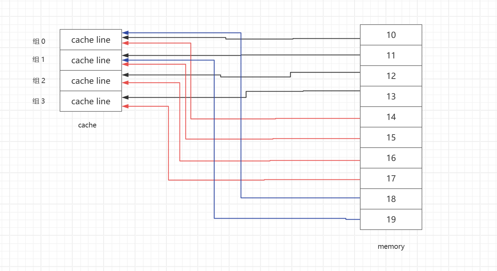

## 深入理解 Cache

### 1. 背景

​	早期计算机系统的存储器层次结构只有三层：CPU 寄存器、DRAM 主存储器和磁盘。随着半导体工艺和芯片设计技术的发展，CPU 的工作频率也越来越高，CPU 与 内存之间的速度差异越来越大，于是 CPU 每读一次指令都得等着内存兄弟好大一会，CPU 被牵制住了，严重影响了计算机系统的整体性能。

### 2. 存储器层次结构

​	实际上，存储器系统（memory system）是一个具有不同容量、成本和访问时间的存储设备的层次结构。CPU 寄存器保存着最常用的数据，靠近 CPU 的小的、快速的高速缓存存储器（Cache memory）作为存储在相对慢速的主存储器中数据和指令的缓冲区域，主存储器存储容量较大的、慢速磁盘上的数据，而这些磁盘又作为存储在通过网络连接的其他机器的磁盘或磁带上的数据的缓冲区域。

​	存储器层次结构是可行的，这是因为与下一个更低层次的存储设备相比，一个编写良好的程序倾向于更频繁地访问某一层次上的存储设备。所以，下一层设备可以更慢速一点，每个 bit 位更便宜，也因此可以很大空间。

>  引自深入理解计算机系统一书

​	由此可见，通过将存储器分层，可以满足日常使用的同时降低成本，只不对于编写系统级软件的工程师来说，不是件简单事情。

### 3. 什么是 Cache

​	Cache 在物理实现上就是 sram (Static Random Access Memory)，Cache 位于 CPU 与 内存（Dram）之间，也称为 L1 cache（一级缓存）。Cache 是位于 CPU 和主内存之间的一个小而快速的内存块，就叫它为缓存吧。CPU 对缓存的访问速度明显快于对主存储器的访问。每当 CPU 读取或写入特定地址时，它都会首先在缓存中查找它，如果它在缓存中找到地址，它将使用缓存中的数据，而不是执行对主内存的访问。通过减少对低速的外部存储器访问时间，显著提高了系统的潜在性能，同时避免驱动外部信号（CPU 引脚产生相关波形）来降低系统的功耗。

​	现代 CPU 内部一般存在多个核心，每个核心都有自己的 L1 与 L2 cache，同时还增加了公用的 L3 cache，如下图：	

​	

### 4. 为什么需要使用 Cache

​	通过了解 Cache 的背景可知， Cache 提高了计算机系统的性能。通过将内存中的一部分数据放到 Cache 中，cpu 可直接从 cache 中获取数据，如果 cpu 要访问的数据不在 cache 中，那它会去内存中获取数据，并将相关数据以及 **周围** 部分的数据全部放到 Cache 中，为下次 **可能** 的 Cache 命中准备。

​	由于 Cache 是有大小限制的，比如 L1 Cache 仅 32KB，也就是说不可能把 CPU 要访问的所有数据都能放到 Cache 中去，因此，对于程序员来说，写出 Cache 友好的程序是非常有必要的。其实 Cache 正是利用了程序的局部性原理，也就是说正在执行的指令与将要执行的指令一般是紧挨着的，正在读写的数据与将要读写的数据也是仅挨着的，比如执行以下程序：

```c
for (i = 0; i < NUM; i++) {
	a += arry[i];
}
```

> Cache hit：cpu 要访问的某地址中的数据在 cache 中，又叫 cache 命中
>
> Cache miss:  cpu 要访问的某地址中的数据不在 cache 中

### 5. Cache 的几种组织格式

​	**cpu 要访问的地址是否在 cache 中** ，是需要做比较的。比如 cpu 要访问  12345 这个地址，如何知道 12345 这个地址是否在 cache 中存在副本呢？那肯定是需要作比较的，怎么比较？如何短时间比出结果？如何尽可能的提高 Cache 命中率？。这就要对 cache 这片内存按照一定的格式进行规划，也就是格式化成某种格式。实际上大多数 CPU 的 cache 按照下图进行组织：

* Line：cache line，一个 cache line 指缓存中最小的可加载单元，如一行可缓存 32 字节内容。
* Index：索引是内存地址的一部分，用于确定该地址对应的缓存行在那个 set 中
* Set: 表示行的集合，即组
* Way: 路，上图为 4 路组相连结构，4路 表示一个 set 中有 4 个 cache line
* Tag: 用于确认该 set 中，到底那个 cache line 与要访问地址的 tag 相同，如果相同，且该 cache line 是有效的，那么就 cache 命中了
* Offset: 定位到了具体的 cache line，然后根据 offect 确定该 cache line 中具体的那个地址

其实就是一个快递小哥找门牌号的过程，其分为三个步骤：根据 index 确定使用那个 set，根据 tag 确定使用那个 cache line，根据 offect 确定具体地址，综合起来可以看成是一个三元组：CI、CT、CO。

* CI：组索引
* CT: 行索引
* CO: 块索引

#### 5.1 直接映射 (direct mapping)

​	每个 set 仅包含一个 cache line，cpu 要访问的地址所对应的 cache index 是固定的，这样不同的地址很容易就会被映射到同一个 cache line，这时候就会发生 cache miss。如图：

​	

​	直接映射的方式非常粗暴，对于一个地址，这个地址对应的 cache line 为 memory % index_max，对于一个地址，很容易定位到具体的 cache line 在何位置。

* 优点：地址映射方式简单粗暴，可以很快速的定位到具体 cache line，相应硬件电路设计较为简单
* 缺点：很容易造成冲突，进而影响 cache 命中率

#### 5.2 全相联映射 (fullyassociative mapping)

​	全相联高速缓存中的只有一个 set，因此，对于一个内存地址来说，就不需要 index 段了，被划分成了一个标记和一个块偏移，如下图：


​	对于全相联映射，如果要比较某个地址是否在 cache 中，需要对比每一个 cache line，因此查找效率非常低。全相联高速缓存只适合 做小的高速缓存，例如 mmu 的 TLB。

* 优点：命中率较高，Cache 的存储空间利用率高
* 缺点：硬件实现很复杂，成本较高，查找效率比较低（需要遍历每个 cache line）

#### 5.3 组相联映射 (setassociative mapping)

​	将 cache line 分成一个一个的组，如果一组中有 4 个 cache line，则叫做 4 路组相联。组相联映射可以看作上上述两种映射的结合版，对于单独一个组，就是一个全相联映射，对于所有的组，又是一个直接相联映射（组内仅一个 cache line）。

* 优点：硬件电路较简单，查找速度快，命中率高，在成本和效率上有所折中，目前主流处理器内部 L1 cache 基本上都采用组相联映射。

### 6. Cache 策略

#### 6.1 分配策略 （Allocation Policy）

​	Cache 的分配策略是指是否需要将数据从主存中分配到内存中。当 CPU 对 cache 发起读写访问时，如果该访问的请求数据不在 cache 中时，cache 控制器必须决定是否要将数据填充到 cache line 中，并将相应的 tag 也填充到 cache line 中。

* 读分配（read allocation）
  * 当 CPU 读数据时，发生 cache miss 时，分配一个 cache line 缓存从主存读取的数据。
* 写分配 （write allocation）
  * 当 CPU 写数据时，发生 cache miss 时，先将主存中的数据加载到 cache line （先做一个读分配动作），然后更新 cache line。该分配策略通常与处理器 write-back 写策略配合使用。

#### 6.2 写策略

写策略指当发生 cache 写命中时，如何更新主存数据。cache 写策略分为两种：

* 写直通（write-through）
  * 写命中时，更新 cache 中的数据并且将 cache 中的数据更新回主存。cache 和主存的数据始终保持一致。
  * 性能不佳，每次写操作都会引起写主存操作，大大降低处理器性能。
  * 解决方案：添加 write buffer
    * 数据写入 cache 的同时写入 write buffer
    * 如果 cpu 写 write buffer 的速率远远大于 write buffer 写主存的速率，那么多大容量的 write buffer 都没用，write buffer 很快就会满。
* 写回（write-back）
  * 写命中时，只更新 cache 中的数据，也就是说 cache 与主存可以包含不同的数据，cache 保存较新的数据，而 cache 保存较旧的数据。
  * 为了标记 cache line 的新旧状态，每一个 cache line 包含一个 bit 位记录，叫做 dirty bit。
  * 如果写命中，这时候会将数据写入 cache，并将 direct bit 置位，如果新来的数据也要使用该 cache line（或者显示的 clean 该 cache line），则会将该 cache line 写入主存，腾出位置。
  * 使用 write-back 策略可以显著减少对外部内存的访问，从而提高性能并节省功耗。但是，如果系统中其他 IP 也会访问拥有 cache 属性的地址，则必须考虑 cache 一致性问题（新数据在 cache 中，并未刷回到主存）。

#### 6.2 逐出策略 （eviction policy）

​	cache 逐出策略指的是当 cache 满了，如何驱逐某一个 cache line，从而腾出一个位置用于缓存新的主存数据，其核心是为了计算出哪个节点应该被剔除，也就是淘汰机制。

* LRU (Least Recently Used) 近期最少使用
  
  * LRU 算法在缓存写满的时候，会根据所有数据的访问记录，淘汰掉未来被访问几率最低的数据。也就是说该算法认为，最近被访问过的数据，在将来被访问的几率最大。
  
  * 为每一个 cache line 设置一个 “计时器”，用于记录每个 cache line 已经多久没有被访问到了。当 cache 满后，驱逐计数器最大的那个 cache line。
  * LRU 基于局部性原理，近期被访问过的主存，在不久的将来很有可能被再次访问。LRU 算法实际运行效果比较好，Cache 命中率较高。
  * 
  
* LFU (Least Frequently Used) 最近不经常使用
  
  * 淘汰访问频率最低的元素
  * LFU 更强调的是节点（这里可以认为是一个 cache line）访问次数，LRU 强调的是访问时间间隔
  
* other..

### 7. Cache 注意事项

​	对于 cpu L1 L2 cache，通常会提供几个方法去操控 cache，比如：enable、disable、clean、invalidate、flush（arm 中表示先 clean 后 invalidate）。但对于系统及开发人员来说，到底什么时候应该 clean，又什么时候 invalidate ?

* clean：将脏 cache line 的内容写入主内存，并清除 cache line 中的 dirty bit。这使得缓存行和主内存的内容相互一致，仅适用于使用 write-back 策略的数据缓存。
* invalidate ：清除 cache line 中的数据。这是通过清除一个或多个 cache line 的有效位来实现的。如果缓存包含脏数据，则通常不应将其无效（如果将其置为无效，会导致新的数据不会刷新到主存中）。

*  如果 CPU 先写了一块内存，然后 DMA / 其他 master 要访问这块内存，必须先 clean，以确保 DMA / 其他 master 访问的内存数据是最新的。
* 如果 DMA / 其他 master 改写了这块内存，要先把这块内存对应的 cache invalid，确保 cpu 访问这块内存时，会到主存中获取，而不是 cache 中的旧数据。