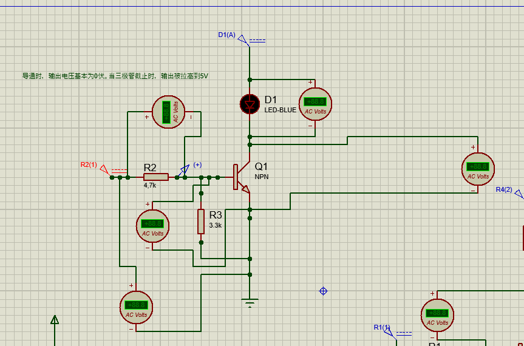
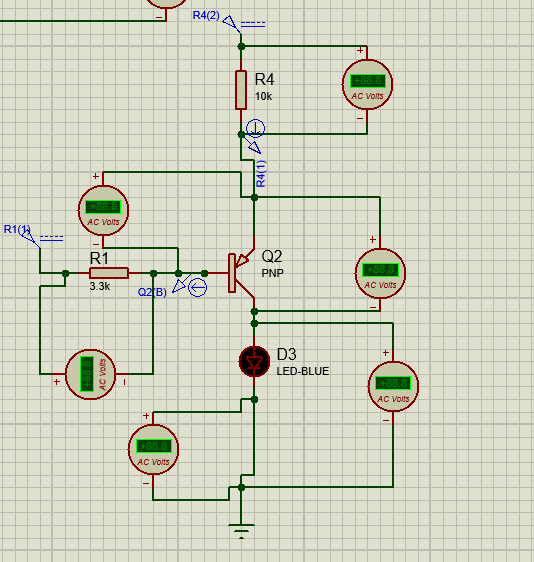

# 常用三极管驱动电路

## NPN型三极管驱动电路

### 1. NPN型三极管驱动电路各个电阻解释

* 直接上图

  

* 基极电阻R2的作用

  > npn型三极管中 be结之间有一个结点阻，成为Rbe,阻值很小，如果输入电压5V加上去，没有R2，由于Rbe非常小，所以电流将会很大(Ib)，Ib很大，通过三极管放大，导致Ic更大，导致直接烧毁，损坏三极管

* 基极电阻R3作用

  > R3的作用是提高了门槛电压，三极管可以近似看成是两个二极管，be结是一个二极管，想要三极管导通，必须在基极加上合适的电压将be结导通，通常是0.7V,但是，这么小的电压都能将三极管导通未免门槛有些低，如果是干扰信号，将会产生误开启，所以加个电阻与R2配合起来去分输入的电压，当输入是0.7v时两个电阻分压，此时be间的电压也就是R3的电压必然是不会大于0.7V的，所以只有提升输入电压才能将三极管导通led灯才亮

### 2. NPN型三极管

* NPN型三极管可以看作是通过输入电压控制be结电压来决定是否导通的开关，当be结电压大于二极管开启电压时，三极管导通。
* 单片机IO口驱动能力小，通过单片机IO口接到NPN三级管的基极来控制三极管的打开与关闭进而来控制负载的打开与关闭。
* NPN型三极管是控制三极管的下游(be结)。

### 3. 注意事项

* N三极管在驱动电路时，负载不能接到控制回路，也就是NPN型三极管负载不能接到be回路

## PNP型三极管驱动电路

### 1. PNP型三极管驱动电路各电阻解释

* 直接上原理图

  

* R4限流电阻，防止输入电流过大，R3也是限流电阻

### 2. PNP型三极管

* PNP型三极管是通过控制电源来决定是否导通，单片机IO口接到基极，当eb直接的压差超过0.7v是，三极管导通
* PNP三极管是控制上游

### 3.注意事项

* PNP型三极管在接驱动电路时，负载同样也不能接在控制回路

