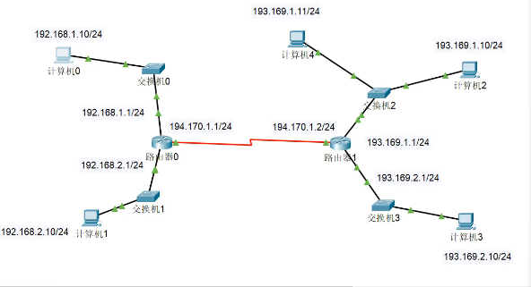
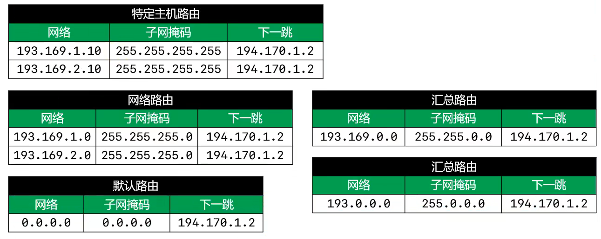

# 计算机网路

## 1. MAC 地址

* 每一个网卡都有一个6字节（48bit）的 MAC 地址 （Media Access Control Address）
* 全球唯一，固化在网卡的 ROM 中，由 IEEE802 标准规定
* 前三字节：OUI（Oranizationally Unique Identifier），组织唯一标识符（厂家），由 IEEE 的注册管理机构分配给厂商
* 后三字节：网络接口标识符，由厂商自己分配
* 48bit 全为 1 时为广播地址
* 当不知道对方主机MAC地址时，可以通过发送ARP广播获取对方的MAC地址，获取成功后，会缓存IP地址、MAC地址的映射信息，俗称：ARP缓存

## 2. IP地址（Internet Protocol Address）

* 互联网上每一个主机都有一个 IP 地址
* 最初是 IPv4 版本，32bit，全球的IP地址已经用完
* 后面推出 IPv6，128bit
* IP地址由两部分组成：网络标识（网络ID）、主机标识（主机ID）
* 统一网段的计算机，网络 ID 相同
* 通过子网掩码可以计算出网络 ID
* 只给出IP地址，不能知道网络 ID
* 主机位全 0 表示一个网段，主机位全为 1 表示广播 IP 地址。发广播时，目标IP地址写成广播地址，表示给这一网段的所有IP地址发送东西。因此这两个 IP 地址不能用
* 计算机和其他计算机通信之前，会先判断目标主机与自己是否处在同一网段
  * 同一网段：不需要路由器进行转发
  * 不同网段：需要路由器转发
* IP地址的分类
  * A类：默认子网掩码是 255.0.0.0，8bit 网络ID（最高bit必须是0），24bit主机ID
  * B类：默认子网掩码是 255.255.0.0，16bit 网络ID（高bit必须是10），16bit主机ID
  * C类：默认子网掩码是 255.255.255.0，24bit 网络ID（高bit必须是110），8bit主机ID
  * D类：以 1110 开头，多播地址
  * E类：以1111开头，保留
  * 只有ABC类地址才能分配给主机
* 主机ID全为0，表示网段
* 主机全为2，广播IP地址，可以通过Ping广播地址查看现象

## 3. 子网划分

​	借用主机位作为子网位，划分出多个子网

* 比如C类IP地址，192.168.1.0/24,表示低8bit表示主机位。192.168.1.0/25，表示第7bit表示主机位，这样就有两个网段，分别 192.168.1.0,192.168.1.128

## 4. 路由

* 默认情况下，路由器只知道跟它直连的网段，非直连网段需要通过静态路由、动态路由告诉它
* 静态路由：管理员手动添加路由信息，适用于小规模网络

	* 手动添加路由表，如下图
	* 两台路由器是直接连接的，IP地址必须处于同一网段，同时配置路由器中的路由表，设定下一跳路由的IP地址，并设定下一跳路由所连接的网段
	* 设置默认路由，只要左边路由器不知道怎么走，就走默认指定的下一跳路由，同时IP与子网掩码全设置为0，如下图路由器0的路由表

* 动态路由：路由器通过路由选择协议（比如RIP、OSPF）自动获取路由信息，适用于大规模网络

## 5. 公网IP、私网IP

* 公网IP：Internet 上的路由器中只有到达公网的路由表，没有到达私网的路由表，公网IP由因特网信息中心（Internet Network Information Center）统一分配和管理

* ISP 需要向Inter NIC 申请公网IP

* 私网IP：家用路由器拿到的是私网 IP 地址，主要用于局域网，私网网段如下

  ```
  A类：10.0.0.0/8（1个A类网络）
  B类：172.16.0.0/16 ~ 172.31.0.0/16（16个B类网络）
  C类：192.168.0.0/24 ~ 192.168.255.0/24（256个C类网络）
  ```

## 6. NAT

* 不同的局域网，IP地址可能是一样的，为什么能够访问互联网？服务器怎么能分得清是那个局域网中的那个IP发来的请求，然后将数据返回给这个IP呢？
* 不管是局域网中的那台IP地址想要访问互联网，路由器会进行NAT转换，将IP地址替换成为公网IP地址，这样服务器返回数据时，就返回这台路由器转换的公网IP，这样路由器就能够将数据返回给局域网中的私网IP了
* 可以节约公网IP资源
* 会隐藏内部真实IP
* NAT分类
  * 静态转换：手动配置NAT映射表，一对一转换（一个私网IP对应一个公网IP）
  * 动态转换：定义外部地址池，动态随机转换，一对一转换
  * PAT（Port Address Translation）:多对一转换，最大成都节约公网IP,采用端口多路复用方式，通过端口号标识不同的数据流（比如：A、B、C三台局域网机器同时访问CSDN，此时这三台公网IP是一样的，NAT路由器会将ABC分别映射到不同的端口号加以区分是内部哪一台私网IP）

