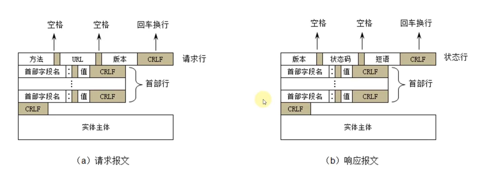

## 1. DNS

* DNS 全程是：Domain Name System，译为：域名系统

* 利用DNS协议，可以将域名解析成对应的IP地址
* DNS 可以基于UDP协议，也可以基于TCP协议，服务器占用53端口
* 

## 2. IP地址分配

* IP地址按照分配方式，可以分为：静态IP地址、动态IP地址
* 静态IP地址
  * 手动设置
  * 使用场景：不怎么挪动的台式机，或者linux服务器等
* 动态IP地址
  * 从DHCP服务器自动获取IP地址
  * 使用场景：移动设备、无线设备

## 3. DHCP

* DHCP（Dynamic Host Configuration Protocol）,译为：动态主机配置协议
  * 基于UDP协议，客户端是68端口，服务器是67端口
* DHCP 服务器会从IP地址池中，挑选一个IP"出租给"客户端一段时间，时间到期就回收他们
* 平时家里上网的路由器就可以充当DHCP服务器