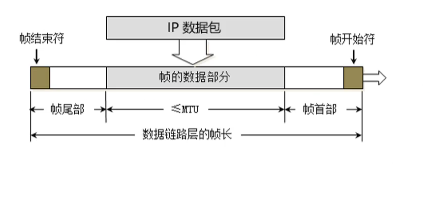
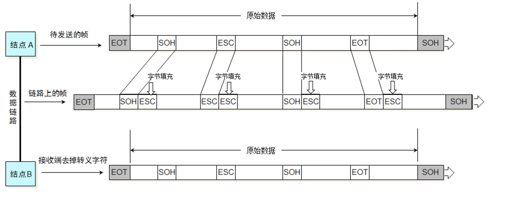
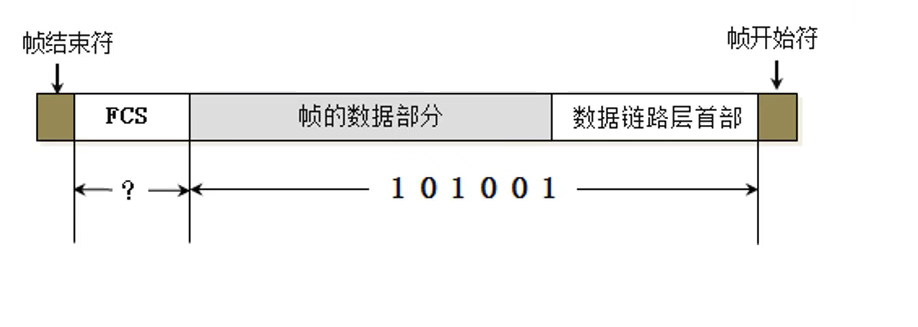
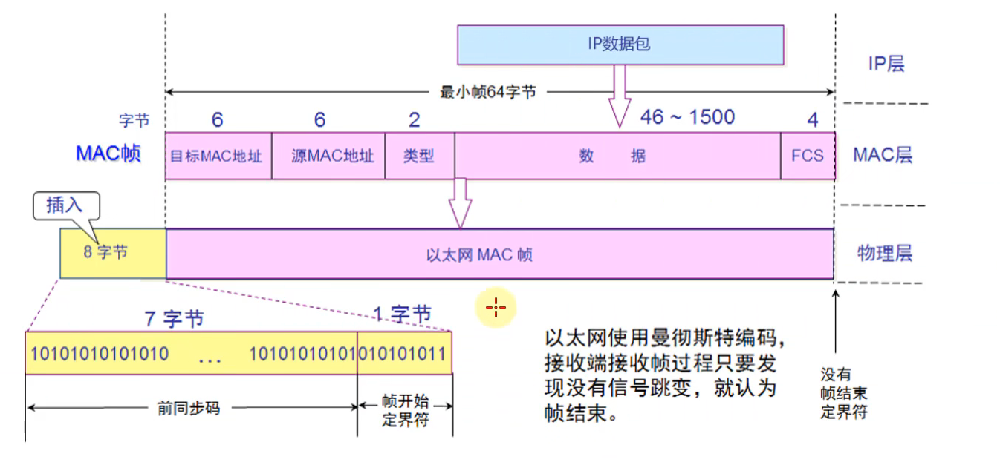
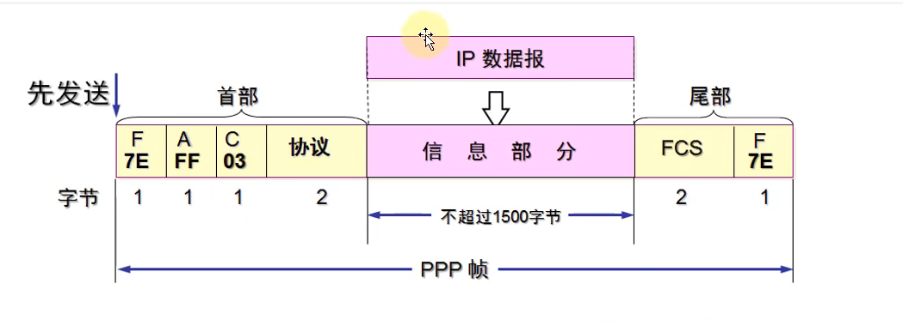
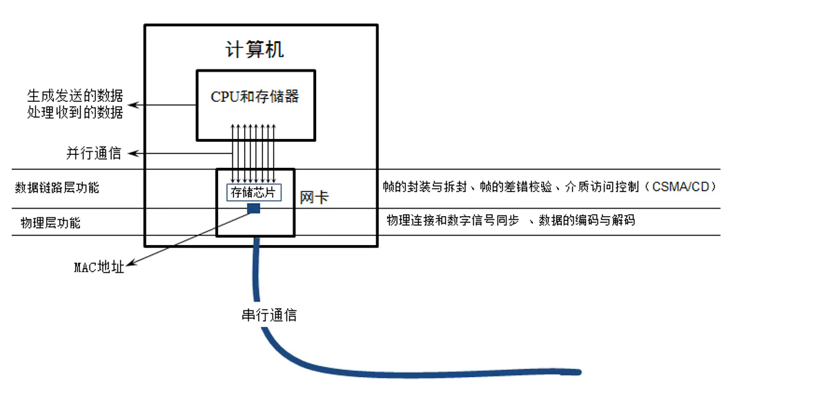

# 计算机网络

## 1、互联网的组成

* 边缘部分：有所有连接在互联网上的主机组成
* 核心部分：由大量网络和连接这些网络的路由器组成

## 2、互联网的边缘部分

​	互联网便于部分就是连接在互联网上的所有

主机。这些主机又称为端系统。端系统在功能上可能有很大的差别，小的端系统可以是一台普通个人电脑、网络摄像头、任何接入网络的嵌入式设备。

​	主机A的某个进程和主机B的另外一个进程进行通信，这种比较严密的说法通常可以简称为"计算机之间的通信"。

​	在网络边缘的端系统之间的通信方式通常可以划分为两大类：客户-服务器方式（C/S方式）和对等方式（P2P方式）。

#### 2.1 客户-服务器方式

​	计算机通信的对象是应用层中的应用进程，采用客服-服务器方式可以使两个应用进程能够进行通信

​	客户（client）和 服务器（server）都是指通信中所设计的两个应用进程。客户-服务器方式所描述的是进程之间服务和被服务的关系。`客户是请求方，服务器是被请求方`，服务请求方和服务提供方都要使用网络核心部分所提供的服务。

* 客户程序
  * 被用户调用后运行，在通信时主动向远端服务器发起通信（请求服务）。因此，客户程序必须知道远端服务器程序的地址
  * 不需要特殊的硬件和很复杂的操作系统（单片机即可）
* 服务器程序
  * 是一种专门用来提供某种服务的程序，可同时处理多个远地和本地客户的请求
  * 系统启动后即自动调用并一直不断的运行着，被动地等待并接受来自各地地客户地通信请求。因此，服务器程序不需要知道客户程序的地址。
  * 一般需要强大的硬件和高级地操作系统支持（得能跑linux了）

#### 2.2 对等连接方式

​	对等连接（peer-to-peer,简写为P2P）是指两台主机在通信时并不区分哪一个是服务请求房哪一个是服务提供方。只要两台主机都运行了对等连接软件，他们就可以进行平等的,对等连接通信。这时，双方都可以下载对方已经存储在硬盘中的共享文档。

## 3、互联网的核心部分

​	在网络核心部分其特殊作用的是路由器，它是一种专用计算机。路由器是实现分组交换地关键构件，其任务是转发收到的分组，这是网络核心部分最重要的功能。何为分组交换？？

​	从通信资源分配的角度来看，交换是按照某种方式动态的分配传输线路的资源。

#### 3.1 分组交换

​	分组交换采用存储转发技术。把一个报文划分为几个分组后再进行传送。通常我们要把发送的整块数据称为一个报文。在发送报文之前，先把较长的报文划分成为一个个更小的等长数据段，例如，每个数据段为 1024 bit，在每一个数据段前面加上一些必要的控制信息组成的首部后，就构成了一个分组。分组又称为包，而分组的首部也可称为“包头”。分组是在互联网中传送的数据单元。分组中的首部是非常重要的，正是由于分组的首部包含了诸如目的地址和源地址等重要控制信息，每一个分组才能在互联网中独立地选择传输路径，并被正确地交付到分组传输地终点。（到底是怎么一回事？？）

·	位于网络核心地主机和位于网络核心部分地路由器都是计算机，但他们地作用却很不一样。主机是为了用户进行信息处理的，并且可以和其他主机通过网络交换信息。路由器则是用来转发分组地，即进行分组交换的。

​	路由器收到一个分组，先暂时存储以下，检查其首部，查找转发表，按照首部中的目的地址，找到合适的接口转发出去，把分组交给下一个路由器。就这样一步一步地以存储转发地方式，把分组交付给最终地目的主机。

​	各路由器之间必须经常交换彼此掌握地路由信息，以便创建和动态维护路由器中的转发表，使得转发表能够在整个网络拓补发生变化时及时更新(感觉很复杂)。

​	存储转发地方式，数据被分成一个个包，在每个交换节点中通过存储转发地机制，将数据从源主机到目标主机。在使用这条链路时，其他链路能够被其他主机所使用，不独享AB主机之间的链路，提高网络的传输效率。分组需要排队，因为节点是共享的。

​	排队和延迟：如果到达速率大于链路输出速率，分组将会排队，等待传输，如果路由器地缓存用完了，分组将会被抛弃。

​	转发是查路由表决定分组从哪个端口出，通过路由模块算出来

​	主机的通信具有很强的突发性，这种情况下，分组交换有更好的共享新，支持的用户更多。

数据报工作原理：在通信之前，无需建立起一个连接，有数据就传输，每一个分组都独立路由，路由器根据分组的目标地址进行路由

## 4、计算机网络地新能

#### 4.1 速率

​	网络技术中的速率是指数据的传送速率，它也成为数据率或比特率，单位是bit/s。10M网络需要之一的是小写b,实际速率得除8。

#### 4.2 带宽

​	在计算机网络中，带宽用来表示网络中某通道传送数据的能力，因此网络带宽表示在单位时间内网络中某信道所能通过的"最高数据率"，每秒多bit。

#### 4.3 吞吐量

​	表示单位时间内通过某个网络（信道、接口）的实际数据量，吞吐量更经常地用于对现实世界中的网络地一种测量

#### 4.4 时延

​	时延（latency）是指数据（一个报文或分组，比特）从网络的一段传送到另外一端所需的时间。

* 发送时延

  是主机或者路由器发送数据帧所需要的时间，也就是从发送数据帧的一个比特算起，到该帧的最后一个比特发送完毕所需的时间

  ​				发送时延= 数据帧长度（bit）/发送速率（bit/s）

* 传播时延

  是电磁波在信道中传播一定的距离需要花费的时间。传播时延计算公式

  ​			传播时延 = 信道长度（m）/电磁波在信道上的传播速率（m/s）

  电磁波在自由控件的传播速率是光速，即 3.0x10^5 km/s。电磁波在网络传输媒体中要比自由空间略低些：铜线电缆中约为 2.3x10^5 km/s,在光纤中传播速率约为2.0x10^5 km/s。例如，1000km的光纤产生的传播时延约为5ms

* 处理时延

  主机或路由器在收到分组时需要花费一定的时间进行处理，例如分析分组的首部、从分组中提取数据部分、进行差错检验或查找适当的路由等。

* 排队时延

  分组在经过网络传输时，要经过许多路由器。分组进入路由器后要现在输入队列中排队等待处理。在路由器确定了转发接口后，还要在输出队列中排队转发。该时延取决于网络当时的通信量、当网络的通信量很大时会发生队列溢出，使分组丢失，这相当于排队时延为无穷大。

## 5. 计算机网路体系结构

#### 5.1 协议与划分层次

​	在计算机网络中要做到有条不紊地交换数据，就必须遵守一些事先约定好的规则，这些规则明确规定了所交换地数据的格式以及有关的同步问题。

​	计算机网络的各层及其协议的集合就是网络的体系结构。体系结构是抽象的，而实体则是具体的，是真正在运行的计算机硬件和软件。

#### 5.2 具有五层协议的体系结构

​	从上到下依次为：应用层、运输层、网络层、数据链路层、物理层。

* 应用层

  任务是通过应用进程呢个的交互来完成特定网络应用，应用层协议定义的是应用进程间通信和交互的规则。对于不同的网络应用需要有不同的应用层协议。在互联网中的应用层协议很多，如域名系统DNS，支持万维网应用的HTTP协议，支持电子邮件的SMTP协议。应用层交互的数据单元称为报文。

  在运输层所提供的可靠的通讯服务基础之上，实现各种各样的网络应用。

  进程间通信：

  * 在同一主机上，应用程序使用进程间通信机制通信（操作系统提供，消息队列、共享内存、管道等等）
  * 不同主机，通过交换报文（Message）来通信，使用操作系统提供的通信服务（socket API），按照应用协议交换报文（借助传输层提供的服务）

  分布式进程通信需要解决的问题：

  * 进程标识和寻址问题。标识自己，让别人能够找到自己

    * 

  * 传输层向应用层是如何提供服务（服务）

    * 位置：层间界面的 sap (TCP/IP: socket)
    * 形式：应用程序接口API (TCP/IP: socket API)

  * 如何使用传输层提供的服务，实现应用进程之间的报文交换，实现应用（用户使用服务）

    * 定义应用层协议：报文格式，解释，时序等
    * 编写程序，使用操作系统提供的 API，调用网络基础设施提供的通信服务传报文，实现应用时序等。

    

    

* 运输层

  任务是负责向两台主机中进程之间的通信提供通用的数据传输服务。应用进程利用该服务传送应用报文。所谓 “通用的”，是指并不针对某个特定网络应用，而是多种应用可以使用同一个运输层服务。

  * 传输控制协议 TCP(Transmission Control Protocol)-------提供面向连接的、可靠的数据传输服务，其数据传输的单位是报文段。
  * 用户数据报协议 UDP(User Datagram Protorol)-------提供无连接的、尽最大努力的数据传输服务，其数据传输的单位是用户数据报

  区分进程，加强网络层所提供的服务，把不可靠变为可靠。

* 网络层

  负责为分组交换网上的不同主机提供通信服务。在发送数据时，网络层把运输层产生的报文段或用户数据报封装成分组或包进行传送。在TCP/IP体系中，由于网络层使用IP协议，因此分组也叫做IP数据报，或简称为数据报。

  ​	网络层的另一个任务是选择合适的路由，使源主机运输层所传下来的分组，能够通过网络中的路由器找到目标主机。

  ​	互联网由大量的异构网络通过路由器互相连接起来的。互联网使用的网络层协议是无连接的网际协议IP(Internet Protocol)和许多种路由选择协议，因此互联网的网络层也就做网际层或IP层。在链路层所提供的相邻两点之间传输的基础之上，以分组为单位端到端的数据传输。 

* 数据链路层

  两台主机之间的数据传输，总是在一段一段的链路上传送的，这就需要使用专门的链路层的协议。在两个相邻节点之间传送数据时，数据链路层将网络层交下来的IP数据报组装成帧，在两个相邻结点间的链路上传送帧。在物理层提供的服务的基础之上，在相邻两点之间传送以帧为单位的数据

* 物理层（physical layer）

  在物理层上所传数数据的单位是比特。

​	假定两台主机通过一台路由器相连接，假定主机1的应用进程AP1向主机2的应用进程AP2传送数据。AP1先将其数据交给本主机的第5层。第5层(应用层)加上必要的控制信息H5就变成了下一层的数据单元。第4层（运输层）收到这个数据单元后，加上本层的控制信息H4,再交给第三层（网络层），成为第三层的数据单元。到了第二层（数据链路层）后，控制信息被分成两部分，分别加到本层数据单元的首部H2和尾部T2，而第一层由于是比特流的传送，所以不在加上控制信息。请注意，传送比特流时应从首部开始传送。

​	OSI 参考模型把对等层次之间传送的数据单位成为该层的协议数据单元PDU。

​	当这一串比特流离开主机1经过网络的物理媒体传送到路由器时，就从路由器的第1层依次上升到第3层。每一层都根据控制信息进行必要的操作，然后将控制信心剥去，将该层剩下的数据单元上交给更高的一层。当分组上升到了第3层时，就根据首部中的目的地址查找路由器中的转发表，找出转发分组的接口，然后往下传送到第二层，加上新的首部和尾部后，再到最下面的第一层，然后再物理媒体上把每一个比特发送出去。

​	在文献中也可以见到术语“协议栈”。这是因为几个层次画在一起很像一个栈的结构。

​	把复杂的网络功能，分解成一个个功能明确的层次，每个层次通过层间接口向上层提供服务。对等层的模块，通过协议交换一些数据信息，本层协议实体，要交换数据单元（PDU），要通过层间接口访问下层所提供的服务，交互数据的目的是，通过本地的处理，通过信息的交换，通过协议的动作来实现更复杂的功能。

## 6、物理层

​	物理层考虑的是怎样才能在连接各种计算机的传输媒体上传输数据比特流，而不是之具体的传输媒体。

​	物理层的作用是要尽可能地屏蔽掉这些传输媒体和通信手段地差异，使物理层上面的数据链路层感觉不到这些差异，这样就可以使数据链路层只考虑如何完成本层的协议和服务，而不必考虑网络具体的传输媒体和通信手段是什么。

* 物理层定义了接口标准、线缆标准、传输速率、传输方式等

## 7、数据链路层

* 链路：从一个节点到相邻节点的一段物理线路，中间没有其他交换节点 

* 数据链路：在一条链路上传输数据时，需要有对应的通信协议来控制数据的传输

* 不同类型的数据链路，所用的通信协议可能是不同的

* 广播信道：CSMA/CD协议（比如同轴电缆、集线器等组成的网络

* 点对点信道：PPP协议（比如2个路由器之间的信道）

* 数据链路层的三个基本问题

  * 封装成帧：将网络层封装好的数据包进行封装，如图，帧的数据部分就是网络层传下来的数据包，MTU是最大传输单元，每一种数据链路层协议都规定了所能够传送帧的数据长度上限
  * 透明传输：当帧的数据部分中存在与帧开始符或者帧结束符时，需要进行转义，否则将会出错，如图，如果数据部分出现帧开始符或者结束符，就插入一个转义字符，接收端收到帧时，发现是转义字符，将转移字符去除
  * 差错检验：发送时帧时，会将帧数据部分与数据链路层首部部分计算出一个值叫做FCS，对方接收到帧时同样计算出一个FSC，然后与发送端填充的FSC作比较，如果不一样说明有错误，网卡将这个帧丢弃，抓包工具就抓不到了，如图：

* CSMA/CD：载波监听/对路访问/冲突检测

  * 载波监听：检测当前信道是否有数据在传输
  * 多路访问：每个站点都可以发送数据，可同时被多个站点接收
  * 冲突检测：发送数据过程中，若其他设备也同时发送数据，则发送的数据必然发生碰撞，导致线路上的信号不稳定，终端设备检测到这种不稳定之后，立马停止发送自己的数据，然后等待一段时间之后在发送
  * 简单总结为：先听后发，边听边法，冲突停发，随机延时重发（比如集线器）

* 使用了CMSA/CD的网络可以称为是以太网（Ethernet），它传输的是以太网帧

  * 以太网帧格式有：Ethernet V2标准、IEEE的802.3标准

  * 为了能够检测正在发送的帧是否产生了冲突，以太网帧至少要64字节（过于短如果发生碰撞，源主机不清楚是对方回的数据还是碰撞回来的数据

  * 以太网使用曼彻斯特编码，接收端接收帧过程只要发现没有信号跳变（以太网使用这个编码之后，就不需要帧开始符与帧结束符了），就认为帧结束，传入到物理层时，物理层会插入前同步码与帧开始定界符，Ethernet V2 帧格式如下图：

    首部：源MAC + 目标MAC + 网咯类型（IPV4/IPV6）

  * 两个路由器直连，是点对点信道，传输的是ppp帧

  * 以太网帧：首部 + 数据 + FCS

* PPP协议：

  * Address字段：上图的值是FF，形同虚设，点到点信道不需要源MAC、目标MAC
  * Control 字段：上图的值是03，目前没什么用

  * 数据帧经过路由器或者交换机时，源IP与目标IP时钟是不会改变的（IP地址来自上层网络层），变化的是帧格式（源MAC、目标MAC等）

  * 以太网帧中存在源MAC与目标MAC，路由器与路由器直连是PPP帧无需MAC（因为以太网帧需要广播，发送的数据会有多台主机收，因此需要目标MAC来告诉这么多主机谁才能收这个数据，其他主机发现MAC不是我，数据直接丢掉）

  * Protocol 字段：内部用到的协议类型

  * 帧开始、结束符：0x7E

* 网卡

  * 网卡收到一个帧，首先会进行差错校验，如果校验通过则接收，否则丢弃
  * Wireshark 抓到的帧没有 FCS，因为他抓到的是差错校验通过的帧（帧尾的FCS会被硬件去掉）
  * 通过 Wireshark 抓包发现，不管是 ICMP协议（ping）还是其他的协议与不同的服务器通信，源 MAC 与目标 MAC都是一样的，这是因为我的电脑到路由器这一段是用的以太网帧，由于访问的服务器跨网段因此需要路由器来转发，因此需要将数据发送至网关，因此目标MAC是网关的MAC 

  

## 8、网络层

* 网络层数据包（IP数据包，Packet）由首部、数据2部分组成

* 数据：很多时候是由传输层传递下来的数据段（Segment）

  

* 版本：占用4位，0b0100 ：IPv4，0x0b0110：IPv6

* 首部长度：占用4位，二进制乘以4才是最终长度

  * 0b0101：20（最小值）
  * 0x1111：60（最大值）

* 区分服务：占8位

  * 占8位
  * 可用于提高网络服务质量（Qos，Quality of Service）

* 总长度：占16位

  * 首部 + 数据的长度之和，最大值是65535

  

* 应用层扔下来的数据难免会超过1500字节，因此，网络层一定有个分片机制

* 由于帧的数据不能超过1500字节，所以过大的IP数据包，需要分成片（fragments）传输给数据链路层

* 每一片都有自己的网络层首部（IP首部） ！！！

* 为了说明这几片属于同一个包，首部必然填有某些信息

* 标识：占16位

  * 数据包的ID,当数据包过大进行分片时，同一个数据包的所有片的标识是一样的
  * 有一个计数器专门管理数据包的ID，每发出一个数据包，ID就加1（保证每个数据包是唯一的）
  * 超过 65535 个数据包，ID从0开始算

* 片偏移：占13位

  * 片偏移乘以8：字节偏移
  * 每一片的长度一定是8的整数倍
  * 通过片偏移分清那个片在包的那个位置

  

* 标志
  * 第一位：保留
  * 第二位（Don't Fragment）：1代表不分片，0代表允许分片
  * 第三位（More Fragments）: 1代表不是最后一片，0代表是最后一片
  
* 通过：ping ip地址 -l 数据包大小，然后使用抓包工具抓数据包，验证头部是否与理论保持一致

* 首部校验和：将IP头部通过一定算法算出校验和之后填入该字段中

* 协议：占8位

  * 表明所封装的数据是使用了什么协议（数据从传输层传下来的）

    

* 如果网络层里面封装的数据是ICMP，IP首部协议字段存储的就是1

* 有些协议是三层协议，或者两层协议，数据包直接就是网络层下发的，比如 CSMA/CD，PPP 协议是工作在数据链路层，ARP IP ICMP（ping 命令）是工作在网络层的协议。

* 生存时间（Time To Live，TTL）

  * 8位

  * 每次经过一个路由器在转发之前会将 TTL 减1，一旦发现TTL减为0，由路由器会返回错误报告

  * 防止两台路由器设置的默认路由是对方，当找不到出口时走默认路由，就会产生死循环

  * ping ip地址 -i ttl，下图中的TTL表示百度服务器的数据包中的TTL值发到我这台电脑时，最终的TTL，也就是减掉后的值

    

* Linux 操作系统 2.0.x kernel 版本时，默认TTL为 64，因此，百度服务器是Linux，达到我这台电脑需要钻过 14 个路由器
* 

* 通过ttl自增，可以判断数据包到服务器经过了那些路由器
* tracert  ip地址（查找经过路由ip）

## 9、运输层

* 两个协议

  * TCP (Transmission Control Protocol)，传输控制协议

  * UDP(User Datagram Protocol)，用户数据报协议

    

* TCP  -- 数据格式

  * 
  * 数据偏移（ 首部有多长，数据部分就偏移多少）
    * 4位：取值范围 0x0101 ~ 0x1111
    * 乘以4：首部长度（根据取值范围反推出首部最大长度60字节，与IP首部长度分配方式一样）
    * 首部长度20 ~ 60
  * 保留：占6位，全为0
  * 6位 标志位
  * TCP/UDP的数据长度，完全可以由IP数据包的首部推测出来
    * 传输层的数据长度 = 网络层的总长度（IP首部有总长度字段） - 网络层首部 - 传输层首部
  * 检验和：伪首部（仅在计算检验和时起作用，并不传递传输层，与 UDP伪首部一样） + 首部 + 数据
  * 标志位
    * URG（urgent）,当为1时，紧急指针字段才有效。表明当前报文段中有紧急数据，应优先尽快发送
    * ACK（Acknowledgment）,当ACK = 1时，确认号字段才有效
    * PSH
    * RST（Reset）,当 RST = 1时，表明连接中出现严重差错，必须释放连接，然后再重新建立连接
    * SYN（Synchronization，同步）
      * 当 SYN = 1，ACK = 0 时，表明这是一个建立连接的请求
      * 如果对方同意连接，则服务器回复 SYN = 1,ACK = 1
    * FIN（Finish）,当为 1 时，表明数据已经发送完毕，要求释放连接
  * 序号（Sequence Number）
    * 4字节
    * 在传输过程中的每一个字节都会有一个编号，连续字节的编号是连续的
    * 在建立连接后，序号代表：这一次传给对方的TCP数据部分的第一个字节的编号
  * 确认号：（Acknowledgment Number）
    * 4个字节
    * 在建立连接后，确认号代表：期望对方下一次传过来的TCP数据部分的第一个字节的编号
  * 窗口
    * 2字节
    * 这个字段有流量控制功能，用以告知对方下一次允许发送的数据大小（字节为单位）

* TCP 的几个要点

  * 可靠传输
  * 流量控制
  * 拥塞控制

* 为运行在不同主机上的应用进程提供逻辑通信

* 传输协议运行在端系统
  * 发送方:将应用报文分成报文段，然后传递给网络层
  * 接收方：将报文段重组成报文，然后传递给应用层
  
* 由多个传输层协议可供应用选择
  
  * Internet:	TCP 和 UDP
  
* 进程间逻辑通信
  * 依赖于网络层的服务（延时、带宽）
  * 并对网络层服务进行增强（数据丢失、顺序混乱、加密）
  
* 可靠的、保序的传输：TCP
  * 多路复用、解复用
  * 拥塞控制
  * 流量控制
  * 建立连接
  
* 不可靠的、不保序的传输：UDP
  * 多路复用、解复用（进程到进程）
  * 没有为尽力而为的IP服务添加更多的其他额外服务
  
* 都不提供的服务：
  * 延时保证
  * 带宽保证
  
* UDP  - 数据格式
  * 无连接的，减少了建立和释放连接的开销
  * 尽最大能力交付，不保证可靠交付
  * 不需要维护一些复杂的参数，首部只有8个字节（TCP的首部至少20个字节）
  * 

* UDP 长度：占16位，首部长度 + 数据长度

* UDP 检验和
  * 计算内容：伪首部 + 首部 + 数据
  * 伪首部：仅在计算检验和时起作用，并不会传递给网络层
  * 

* 端口

  * 2字节
  * 端口号取值范围 0~65535
  * 客户端的源端口是临时开启的随机端口

* 服务器端口一直监听着（守护进程？？）

* 防火墙可以设置开启/关闭某些端口来提高安全性

* 常用命令：netstat -an：查看被占用的端口，netstat  -anb：查看被占用的端口，占用端口的应用程序

#### 9.1、多路复用/解复用

* 在发送主机多路复用
  * 从多个套接字（socket API）接受来自多个进程的报文，根据套接字对应的IP地址和端口号等信息对报文段用头部加以封装（该头部信息用于接收端解复用）
* 在接收方主机多路解复用
  * 根据报文段的头部信息中的 IP 地址和端口号将接收到的报文段发给正确的套接字（和对应的应用进程）
* TCP 使用源端口、源IP、目标端口、目标IP，发给正确的应用进程
* UDB 使用目标IP、目标端口

#### 9.2、可靠数据传输

#### 9.3、无连接传输 UDP	

1. UDP 校验和

* 目标：检测在被传输地报文段中的差错
* 发送方做差错控制编码
  * 将报文段的内容是为16比特的整数
  * 发送方将校验和放在UDP的脚丫和字段
* 接收方解码
  * 计算接收到的报文段的校验和
  * 检查计算出的校验和与校验字段内容是否相等
    * 不相等---检测到差错
    * 相等-----没有检测到差错，但也许还是有差错

2. 无连接

* UDP 发送端和接收端之间没有握手

* 每个UDP报文段都被独立地处理

3. 应用场景

* 流媒体
* DNS
* SNMP

用户数据报，在 IP 所提供服务的基础上，增加了复用/解复用，支持了进程到进程，IP 只能提供主机到主机之间的服务

#### 9.4、流量控制

#### 9.5、拥塞控制

